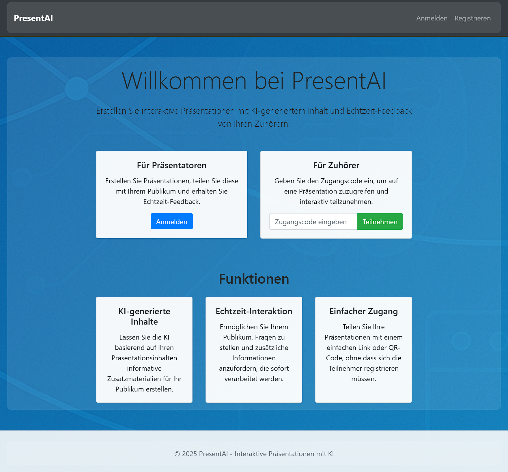

# PresentAI - Intelligente Interaktive Präsentationsplattform



PresentAI ist eine moderne, KI-gestützte Webanwendung für interaktive Präsentationen mit innovativer **geteilter Architektur**. Die Plattform erstellt statische Info-Seiten vom Präsentator und dynamische Feedback-Bereiche von Zuhörern - vollständig getrennt und intelligent verwaltet. Mit fortschrittlicher KI-Integration, festen Verarbeitungsintervallen und kompakter Feedback-Darstellung bietet PresentAI eine nahtlose Erfahrung für moderne Präsentationen.

## 🎯 Hauptfunktionen

### Innovative Geteilte Architektur
- **Statische Info-Seite**: Einmalig generiert aus Titel, Beschreibung und Abstract - bleibt unverändert
- **Dynamischer Feedback-Bereich**: Separate Sektion für Zuhörer-Feedback mit automatischer Kategorisierung
- **Klare Trennung**: Info-Inhalte und Feedback-Inhalte sind vollständig getrennt
- **Ergänzungs-System**: Neue Feedbacks werden intelligent zu bestehenden Inhalten hinzugefügt
- **Zusätzliche Informationen**: Präsentierende können jederzeit zusätzliche Infos (z.B. Antworten auf Fragen) hinzufügen
- **Live-Info-Freigabe**: Kontrollierte Sichtbarkeit der Live-Infoseite für Zuhörer

### KI-gestützte Inhaltsgenerierung
- **Vollautomatische Kategorisierung**: KI übernimmt komplette Feedback-Klassifizierung ohne Code-Regeln
- **Intelligente Zusammenfassung**: Ähnliche Fragen/Kommentare werden automatisch gruppiert
- **Sichere Link-Behandlung**: ALLE URLs landen in separater "⚠️ Ungeprüfte Links" Sektion mit Beschreibungen
- **Flexible KI-Modelle**: Unterstützung für GPT-4, GPT-4.1-mini und andere Modelle
- **Automatische Content-Bereinigung**: Markdown-Optimierung für saubere Darstellung

### Robuste Fehlerbehandlung
- **Kontext-Erhaltung**: Bei API-Fehlern bleibt der bestehende Inhalt sichtbar
- **Intelligente Retry-Mechanismen**: Automatische Wiederholungsversuche mit konfigurierbaren Verzögerungen
- **Manuelle Retry-Funktion**: Präsentatoren können fehlgeschlagene KI-Aufrufe manuell erneut starten
- **Transparente Fehlermeldungen**: Klare Kommunikation bei Problemen

### Erweiterte Sicherheit
- **Content-Filterung**: Automatische Entfernung unangemessener oder beleidigender Inhalte
- **Soft-Delete System**: Gelöschte Präsentationen bleiben in der Datenbank erhalten
- **Audit-Trail**: Vollständige Nachverfolgung von Löschungen und Änderungen

### Echtzeit-Interaktion
- **Feste Verarbeitungsintervalle**: Garantierte Verarbeitung alle 30 Sekunden (konfigurierbar)
- **Nie verzögerte Verarbeitung**: Auch bei Dauerfeuer-Feedback erfolgt pünktliche Verarbeitung
- **Kompakte Feedback-Anzeige**: Status-Symbole (✅ verarbeitet, ⏳ wartend) für bessere Übersicht
- **Batch-Verarbeitung**: Effiziente Sammlung mehrerer Feedbacks pro Intervall
- **Live-Updates**: Automatische Aktualisierung ohne manuelles Neuladen
- **QR-Code Integration**: Einfacher Zugang für Zuhörer
- **Teilnehmer-Namen**: Optionale Namenserfassung mit localStorage für wiederholte Nutzung

### Erweiterte Präsentator-Kontrolle
- **Einzelnes Feedback löschen**: Unerwünschte Feedbacks direkt aus der Liste entfernen
- **Feedback-Verarbeitung zurücksetzen**: Alle verarbeiteten Feedbacks wieder auf wartend stellen
- **Zusätzliche Informationen**: Jederzeit neue Infos zum statischen Bereich hinzufügen
- **Live-Info-Freigabe**: Ein/Ausblenden der Live-Infoseite für Zuhörer per Knopfdruck
- **Feedback-Sperrung**: Temporäres Blockieren neuer Feedbacks von Zuhörern

## 🛠️ Systemanforderungen

- Python 3.8 oder höher
- Flask 2.0+
- SQLAlchemy
- OpenAI API-Zugang (GPT-4, GPT-4.1-mini, oder GPT-4o-mini)
- Font Awesome 6.0+ für Status-Icons
- **Gunicorn** für Produktionsumgebung (parallele Zugriffe)
- Weitere Abhängigkeiten siehe `requirements.txt`

## 🚀 Installation

### 1. Repository vorbereiten
```bash
git clone <repository-url>
cd ConfChat
```

### 2. Virtuelle Umgebung einrichten
```bash
python -m venv venv

# Windows
venv\Scripts\activate

# macOS/Linux
source venv/bin/activate
```

### 3. Abhängigkeiten installieren
```bash
pip install -r requirements.txt
```

### 4. Umgebungsvariablen konfigurieren
```bash
# Erforderlich
export OPENAI_API_KEY=ihr-openai-api-schlüssel

# Optional (wird automatisch generiert wenn nicht gesetzt)
export REGISTRATION_PASSWORD=ihr-registrierungspasswort
export SECRET_KEY=ihr-geheimer-schlüssel
```

**Wichtig**: Das `REGISTRATION_PASSWORD` wird beim ersten Start automatisch generiert und in der Konsole angezeigt, falls nicht gesetzt.

### 5. Datenbank migrieren (falls erforderlich)
```bash
python migrate_db.py
```

### 6. Anwendung starten

#### Entwicklungsumgebung
```bash
python app.py
```

#### Produktionsumgebung (empfohlen)

**Linux/macOS/WSL:**
```bash
# Minimal-Setup für parallele Zugriffe
./start_production.sh

# Erweiterte Konfiguration (höhere Performance):
./start_production_advanced.sh

# Oder manuell:
python -m gunicorn --workers 1 --threads 4 --bind 0.0.0.0:5000 app:app
```

**Windows (ohne WSL):**
```cmd
# Windows-kompatible Lösung mit Waitress (Port 8000)
start_production.bat

# Oder manuell:
python -m pip install waitress
python -m waitress --host=127.0.0.1 --port=8000 --threads=4 app:app
```

**Hinweis:** Port 5000 ist unter Windows oft gesperrt. Das Windows-Skript verwendet daher Port 8000. Bei Problemen siehe `WINDOWS_TROUBLESHOOTING.md`.

#### Docker (empfohlen für Produktion)
```bash
# Mit Environment-Datei
cp .env.example .env
# .env bearbeiten und OPENAI_API_KEY setzen
docker-compose up -d

# Oder mit docker-run.sh Skript
OPENAI_API_KEY=sk-... ./docker-run.sh --port 8080

# Oder manuell
docker run -d \
  -p 8080:5000 \
  -e OPENAI_API_KEY=sk-... \
  -v $(pwd)/instance:/app/instance \
  ghcr.io/ihrusername/confchat:latest
```

### 7. Zugriff
- **Entwicklung:** http://127.0.0.1:5000/
- **Linux/macOS/WSL:** http://0.0.0.0:5000/
- **Windows:** http://127.0.0.1:8000/
- **Docker:** http://localhost:8080/ (oder gewählter Port)

## 📁 Projektstruktur

```
ConfChat/
├── app.py                      # Hauptanwendung (Flask)
├── migrate_db.py              # Datenbank-Migrierungsskript
├── Dockerfile                 # Docker-Image für Produktion
├── docker-compose.yml         # Docker-Compose für lokale Entwicklung
├── docker-run.sh              # Docker-Start-Skript mit Optionen
├── .env.example               # Umgebungsvariablen-Vorlage
├── start_production.sh        # Produktions-Start-Skript (Linux/macOS/WSL)
├── start_production_advanced.sh # Erweiterte Produktions-Konfiguration (Linux/macOS/WSL)
├── start_production.bat       # Windows-Produktions-Start-Skript (Port 8000)
├── WINDOWS_TROUBLESHOOTING.md # Windows-spezifische Problemlösungen
├── requirements.txt           # Python-Abhängigkeiten
├── CLAUDE.md                  # Entwickler-Dokumentation
├── instance/
│   └── presentations.db      # SQLite-Datenbank
├── templates/                 # Jinja2-Templates
│   ├── base.html             # Basis-Layout
│   ├── dashboard.html        # Präsentations-Dashboard
│   ├── view_presentation.html # Präsentations-Manager
│   ├── public_view.html      # Öffentliche Zuhörer-Ansicht
│   └── ...                   # Weitere Templates
├── static/                    # Statische Dateien
└── test_*.py                 # Test-Suiten
```

## 🎭 Verwendung

### Für Präsentatoren

1. **Registrierung/Anmeldung**
   - Erster Benutzer wird automatisch als Admin eingerichtet
   - Nutzen Sie das generierte Registrierungspasswort

2. **Präsentation erstellen**
   - Titel, Beschreibung, Kontext und Hauptinhalt eingeben
   - KI generiert automatisch statische Info-Seite (einmalig)

3. **Zuhörer einladen**
   - QR-Code oder direkten Link teilen
   - Zuhörer erhalten Zugang zur Live-Infoseite

4. **Feedback verwalten**
   - Kompakte Übersicht mit Status-Symbolen (✅ verarbeitet, ⏳ wartend)
   - Teilnehmer-Namen werden angezeigt falls angegeben
   - Automatische Verarbeitung alle 30 Sekunden (garantiert)
   - Manuelle Retry-Funktion bei KI-Problemen
   - Vollautomatische KI-Kategorisierung ohne manuelle Regeln
   - **Einzelne Feedbacks löschen**: Unerwünschte Beiträge direkt entfernen
   - **Feedback-Reset**: Alle Feedbacks wieder auf wartend stellen

5. **Zusätzliche Informationen verwalten**
   - Neue Informationen jederzeit zum statischen Bereich hinzufügen
   - Automatische Integration in die Live-Infoseite
   - Zeitstempel für bessere Nachverfolgung

6. **Live-Info-Freigabe kontrollieren**
   - Per Default ausgeblendet für Zuhörer
   - Ein-Klick-Freigabe für Live-Infoseite
   - Sofortige Sichtbarkeit/Verbergung für alle Zuhörer

7. **Feedback-Kontrolle**
   - Ein-Klick-Sperrung neuer Feedbacks von Zuhörern
   - Temporäre Blockierung unabhängig von Live-Info-Freigabe
   - Klare Benachrichtigung für Zuhörer bei gesperrtem Feedback

### Für Zuhörer

1. **Zugang über QR-Code oder Link**
2. **Namen eingeben (einmalig)**
   - Name wird im Browser gespeichert für zukünftige Feedbacks
   - Erscheint in der Presenter-Ansicht für bessere Zuordnung
3. **Live-Infoseite betrachten** (nur wenn freigegeben)
   - Statische Info-Seite vom Präsentator
   - Zusätzliche Informationen vom Präsentator
   - Dynamischer Feedback-Bereich von anderen Zuhörern
   - Automatisch aktualisierte Inhalte alle 10 Sekunden
   - Strukturierte Darstellung mit Markdown-Formatierung
   - Nur sichtbar wenn Präsentator die Live-Info freigegeben hat
4. **Interaktion**
   - Fragen stellen (landen in "Offene Fragen")
   - Links teilen (erscheinen in "⚠️ Ungeprüfte Links" mit Beschreibung)
   - Faktische Informationen beitragen
   - Kommentare abgeben
   - **Hinweis**: Bei gesperrtem Feedback wird eine entsprechende Meldung angezeigt

## ⚙️ Erweiterte Konfiguration

### Feedback-Verarbeitung
```python
# In app.py anpassbar
FEEDBACK_PROCESSING_INTERVAL = 30  # Feste Verarbeitungsintervalle (Sekunden)
CLIENT_REFRESH_INTERVAL = 20       # Client-Aktualisierungsintervall
```

**Neue Architektur**:
- **Feste Zeitslots**: Verarbeitung erfolgt zu festen Zeiten (z.B. :00, :30 jeder Minute)
- **Garantierte Verarbeitung**: Auch bei kontinuierlichem Feedback wird pünktlich verarbeitet
- **Kein Verschieben**: Neue Feedbacks verschieben die Verarbeitung nicht

### Retry-Mechanismen
- **Automatische Verzögerung**: 10 Sekunden nach API-Fehlern
- **Kontext-Erhaltung**: Bestehende Inhalte bleiben bei Fehlern sichtbar
- **Manuelle Kontrolle**: Retry-Button für Präsentatoren

### Content-Filterung & KI-Integration
- **Vollautomatische Filterung**: KI übernimmt komplette Spam/Beleidigung-Erkennung
- **Intelligente Kategorisierung**: Fragen, Links, Fakten, Kommentare werden automatisch sortiert
- **Sichere Link-Behandlung**: Alle URLs landen zwingend in "⚠️ Ungeprüfte Links" Sektion
- **Zusammenfassung**: Ähnliche Feedbacks werden intelligent gruppiert
- **Markdown-Bereinigung**: Entfernung störender Code-Block-Markierungen
- **Flexible KI-Modelle**: GPT-4, GPT-4.1-mini, GPT-4o-mini unterstützt

## 🔧 Entwicklung & Erweiterung

### Wichtige Komponenten

1. **Geteilte KI-Integration**
   - `generate_static_info_content()`: Einmalige Info-Seiten-Generierung
   - `generate_feedback_content()`: Dynamische Feedback-Verarbeitung
   - Vollautomatische KI-Kategorisierung ohne Code-Regeln
   - Ergänzungs-System statt Neugenerierung

2. **Feste Intervall-Verarbeitung**
   - Zeitslot-basierte Verarbeitung (z.B. alle 30 Sekunden)
   - Garantierte Pünktlichkeit auch bei Dauerfeuer-Feedback
   - Thread-basierte Background-Verarbeitung
   - Intelligente Warteschlangen-Verwaltung

3. **Soft-Delete System**
   - Präsentationen werden als gelöscht markiert, bleiben aber in DB
   - Vollständiger Audit-Trail mit Teilnehmer-Namen
   - Wiederherstellbarkeit

### Tests ausführen
```bash
# Einzelne Tests
python test_improved_prompt.py
python test_soft_delete.py
python test_markdown_filter.py

# Alle Tests
python -m pytest test_*.py
```

### Demo-Skripte
```bash
python demo_improved_prompt.py    # Feedback-Kategorisierung
python demo_soft_delete.py        # Soft-Delete Verhalten
python demo_improved_behavior.py  # Fehlerbehandlung
```

## 🚀 Produktionsdeployment

### Docker (Empfohlen)

**Schnellstart mit Docker:**
```bash
# 1. Repository klonen
git clone <your-repo-url>
cd ConfChat

# 2. Umgebungsvariablen setzen
cp .env.example .env
# .env bearbeiten und OPENAI_API_KEY setzen

# 3. Starten
docker-compose up -d
```

**Erweiterte Docker-Optionen:**
```bash
# Mit docker-run.sh (mehr Kontrolle)
OPENAI_API_KEY=sk-... ./docker-run.sh --port 8080 --detach

# GitHub Container Registry Image verwenden
docker run -d \
  -p 8080:5000 \
  -e OPENAI_API_KEY=sk-... \
  -v $(pwd)/instance:/app/instance \
  ghcr.io/ihrusername/confchat:latest

# Container-Management
./docker-run.sh --logs    # Logs anzeigen
./docker-run.sh --stop    # Container stoppen
```

**GitHub Actions Setup:**
1. Repository auf GitHub pushen
2. Actions werden automatisch ausgeführt
3. Docker-Image wird in GitHub Container Registry gepusht
4. Image URL: `ghcr.io/ihrusername/confchat:latest`

### Minimal-Setup für parallele Zugriffe (ohne Docker)

Das mitgelieferte Produktions-Setup verbessert die Performance erheblich:

```bash
# Einfacher Start (empfohlen)
./start_production.sh

# Erweiterte Konfiguration (mehr Performance, kleines Risiko)
./start_production_advanced.sh
```

**Vorteile gegenüber `python app.py`:**
- **4x bessere Parallelverarbeitung** durch Multi-Threading
- **Robustheit** bei Worker-Crashes
- **Produktions-optimierte Konfiguration**
- **Bessere Ressourcennutzung**

### Performance-Vergleich

| Setup | Concurrent Users | Threading | Stabilität | Empfehlung |
|-------|------------------|-----------|------------|------------|
| `python app.py` | ~10-20 | Entwicklungsserver | Niedrig | Nur Entwicklung |
| **Docker** | ~500-1000+ | Gunicorn + Container | **Sehr hoch** | **✅ Produktion** |
| `start_production.sh` | ~100-200 | 1 Worker + 4 Threads | Hoch | Einfache Prod |
| `start_production_advanced.sh` | ~200-500 | 2 Worker + 2 Threads | Mittel* | Erfahrene Nutzer |

*\*Risiko: Background-Processing könnte doppelt ausgeführt werden*

**Docker-Vorteile:**
- **Isolation**: Keine Abhängigkeitskonflikte
- **Portabilität**: Läuft überall gleich
- **Skalierung**: Einfache Horizontal-Skalierung
- **CI/CD**: Automatisches Building und Deployment
- **Wartung**: Container-Updates ohne Server-Neustart

### Erweiterte Produktions-Optionen

Für höhere Skalierung siehe Vollarchitektur-Empfehlungen:
- **PostgreSQL** statt SQLite (>500 concurrent users)
- **Celery** für Background-Tasks (eliminiert Threading-Probleme)
- **Redis** für Session-Storage bei Multi-Worker Setup
- **Nginx** als Reverse Proxy für statische Dateien

## 🎨 Anpassungen

### KI-Provider wechseln
Die Anwendung unterstützt verschiedene KI-APIs:
- **OpenAI GPT-4** (beste Qualität)
- **OpenAI GPT-4.1-mini** (optimiert)
- **OpenAI GPT-4o-mini** (kostengünstig)
- **Claude** (Anthropic) - anpassbar
- **Google Gemini** - anpassbar
- **Hugging Face** - anpassbar

Einfach das `model`-Feld in den API-Aufrufen ändern.

### UI-Anpassungen
- Templates in `templates/` Verzeichnis
- Bootstrap 4 + Font Awesome 6 für responsives Design
- Kompakte Feedback-Anzeige mit Status-Symbolen
- Erweiterbare CSS-Klassen

### Funktionalitäts-Erweiterungen
- WebSocket-Integration für Echtzeit-Chat
- Datei-Upload für Präsentationen
- Erweiterte Benutzerverwaltung
- Export-Funktionen (PDF, Word)

## 🛡️ Sicherheit

- **Eingabe-Validierung**: Schutz vor Injection-Angriffen
- **Content-Filterung**: Automatische Moderation
- **Session-Management**: Sichere Benutzer-Sessions
- **API-Schlüssel-Schutz**: Umgebungsvariablen für sensible Daten

## 📊 Monitoring & Debugging

- **Konsolen-Logging**: Detaillierte Logs für Debugging
- **Error-Tracking**: Vollständige Fehlerprotokollierung
- **Performance-Monitoring**: API-Aufruf-Optimierung
- **Audit-Trail**: Benutzeraktivitäten nachverfolgbar

## 🤝 Contributing

1. Fork des Repositories
2. Feature-Branch erstellen (`git checkout -b feature/AmazingFeature`)
3. Änderungen committen (`git commit -m 'Add some AmazingFeature'`)
4. Branch pushen (`git push origin feature/AmazingFeature`)
5. Pull Request erstellen

## 📝 Lizenz

Dieses Projekt steht unter der MIT-Lizenz. Siehe `LICENSE` Datei für Details.

## 🙏 Danksagungen

- OpenAI für GPT-4o-mini API
- Flask-Community für das excellente Framework
- Bootstrap für das responsive UI-Framework
- Alle Contributor und Tester